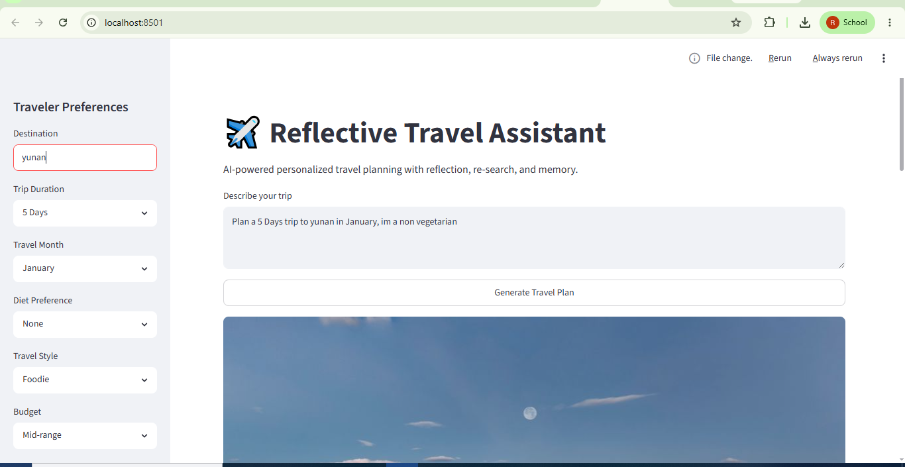
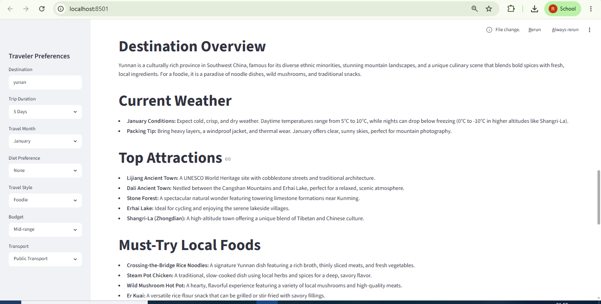
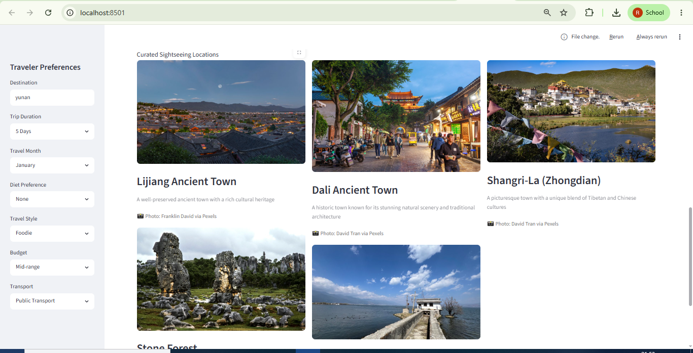
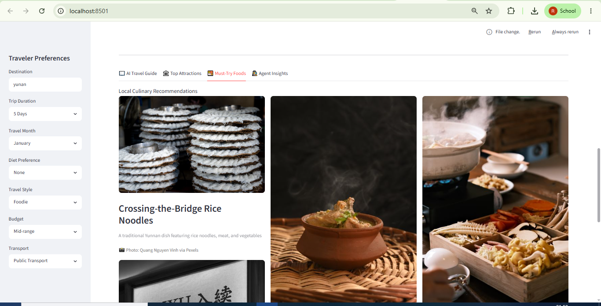
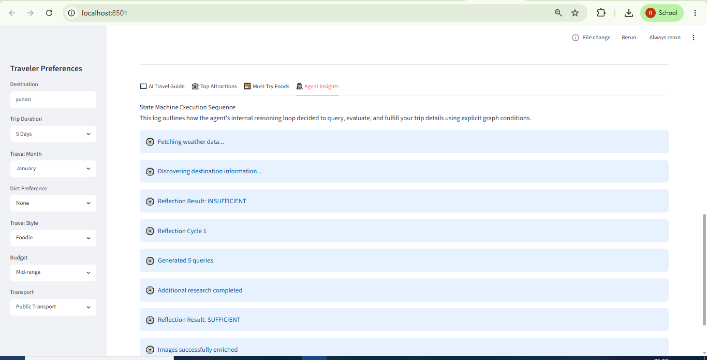
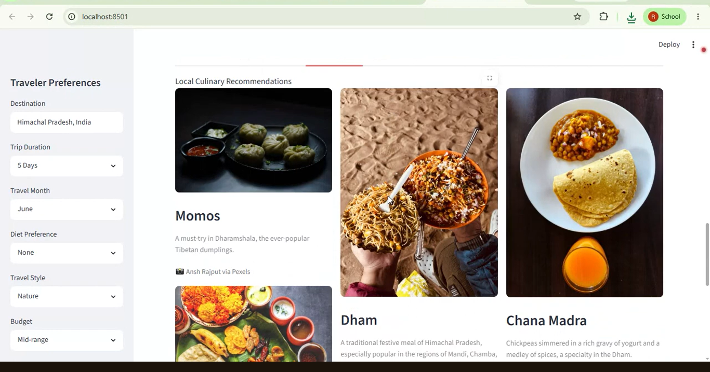
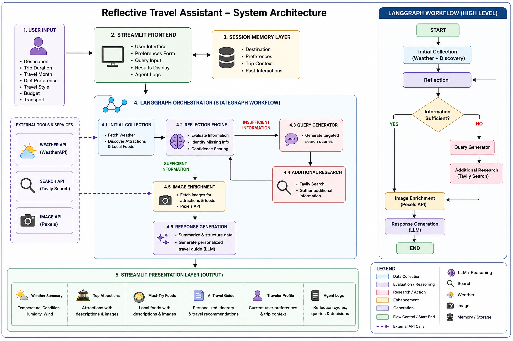

# ✈️ Reflective Travel Assistant

> A memory-aware agentic travel planning system built on **LangGraph** — combining real-time weather data, web search, LLM reasoning, self-evaluation, and conditional re-search to generate personalized, visually enriched travel itineraries.

---

## 📸 Demo

### Main Interface & Traveler Preferences



> *Main Streamlit dashboard — destination input, traveler preference sidebar, and the Generate Travel Plan trigger.*

---

### AI Travel Guide Output



> *Generated itinerary with live weather metrics, traveler profile cards, and the full personalized day-by-day plan.*

---

### Top Attractions Gallery



> *Curated sightseeing locations enriched with real images from the Pexels API.*

---

### Must-Try Foods Gallery



> *Local culinary recommendations with images and descriptions, filtered by diet preference.*

---

### Agent Insights — Reflection Trace



> *Live state machine execution log — reflection cycles, confidence scores, identified gaps, and research sources.*

---

### 🎬 Demo Video

[](https://youtu.be/IVjP-WncRB0)

> *Click the thumbnail above to watch a full walkthrough of the agentic workflow.*

---

## 🏗️ Architecture



> *System architecture — LangGraph StateGraph workflow with conditional reflection loop, external tool integrations, and Streamlit presentation layer.*

### High-Level Workflow

```
User Input (Destination + Preferences)
            │
            ▼
   [LangGraph StateGraph]
            │
            ▼
  ┌─────────────────────┐
  │  Initial Collection │
  │  ├─ WeatherAPI      │  ← Current temperature, humidity, wind, condition
  │  └─ Tavily Search   │  ← Attractions, local foods, travel tips
  └──────────┬──────────┘
             │
             ▼
    ┌─────────────────┐
    │   Reflection    │  ← LLM evaluates information completeness
    │   Engine        │    Scores confidence (0–100%)
    │                 │    Identifies specific knowledge gaps
    └────────┬────────┘
             │
     ┌───────┴────────┐
     │                │
  SUFFICIENT      INSUFFICIENT (cycle < 2)
     │                │
     │                ▼
     │     ┌─────────────────────┐
     │     │   Query Generator   │  ← LLM generates targeted search queries
     │     │   + Researcher      │  ← Tavily fills identified gaps
     │     └──────────┬──────────┘
     │                │
     │                └──── loops back to Reflection
     │
     ▼
  ┌──────────────────────┐
  │   Image Enrichment   │  ← Pexels API attaches photos to attractions & foods
  └──────────┬───────────┘
             │
             ▼
  ┌──────────────────────┐
  │  Response Generation │  ← LLM synthesizes personalized Markdown travel guide
  └──────────┬───────────┘
             │
             ▼
   Streamlit Presentation Layer
   ├── Weather Dashboard
   ├── Traveler Profile Cards
   ├── AI Travel Guide (downloadable)
   ├── Attractions Gallery
   ├── Foods Gallery
   └── Agent Insights (reflection history + execution log + sources)
```

---

## ✨ Features

- **Reflective agentic loop** — the agent evaluates its own information quality before generating a response; if gaps are found, it re-searches automatically
- **Confidence scoring** — every reflection cycle produces a 0–100% confidence score derived from identified knowledge gaps, displayed as a live badge in the UI
- **Reflection history timeline** — each cycle's status, confidence, and specific gaps are logged and surfaced in the Agent Insights tab as collapsible expanders
- **Memory-aware personalization** — diet, travel style, budget, and transport preferences are stored in session memory and enforced at the prompt level
- **Multi-tool data collection** — WeatherAPI for real-time conditions, Tavily Search for discovery and re-research, Pexels API for visual enrichment
- **Deduplicated research merging** — research items from multiple cycles are deduplicated before being passed to the LLM, preventing repeated facts
- **Clean prompt construction** — only text-relevant fields (name, description) from travel data are sent to the LLM; image URLs and metadata are stripped to reduce token noise
- **Downloadable itinerary** — generated Markdown guide can be saved locally with one click
- **Session state persistence** — results survive sidebar interactions without re-running the agent
- **Research source transparency** — all Tavily sources used across research cycles are listed in the Agent Insights tab

---

## ⚙️ Tech Stack

| Component | Technology |
|---|---|
| Frontend | Streamlit |
| Workflow Orchestration | LangGraph (StateGraph) |
| Agent Framework | LangChain |
| Primary LLM | Gemini Flash Lite |
| Secondary LLM | Groq (LLaMA Models) |
| Weather Data | WeatherAPI |
| Web Search & Research | Tavily Search API |
| Image Retrieval | Pexels API |
| Language | Python 3.10+ |
| Environment | Python Virtual Environment |

---

## 📁 Project Structure

```
reflective_travel_assistant/
│
├── streamlit_app.py           # Streamlit dashboard — UI, session state, result rendering
├── main.py                    # CLI entry point
├── env                        # Environment variables (API keys)
├── requirements.txt           # Python dependencies
│
├── agents/
│   ├── langgraph_workflow.py  # LangGraph StateGraph — nodes, edges, conditional router
│   └── response_generator.py # LLM prompt builder and final guide generator
│
├── tools/
│   ├── weather_tool.py        # WeatherAPI integration — temperature, humidity, wind
│   ├── discovery_tool.py      # Tavily-powered destination discovery
│   └── image_tool.py          # Pexels API image enrichment for attractions & foods
│
├── reflection/
│   └── reflector.py           # LLM-based information evaluator — status + gap detection
│
├── research/
│   ├── query_generator.py     # LLM generates targeted queries for identified gaps
│   └── researcher.py          # Executes Tavily searches for additional information
│
├── memory/
│   └── session_memory.py      # In-session traveler preference store
│
├── llms/
│   └── router.py              # LLM provider selector
│
├── utils/
│   └── parser.py              # LLM response text extractor
│
├── assets/
│   ├── styles.css             # Custom Streamlit CSS
│   ├── architecture.png       # System architecture diagram
│   └── screenshots/           # README screenshots
│
└── README.md
```

---

## 🚀 Getting Started

### 1. Clone the repository

```bash
git clone https://github.com/your-username/reflective-travel-assistant.git
cd reflective-travel-assistant
```

### 2. Create and activate a virtual environment

```bash
python -m venv venv

# Windows
venv\Scripts\activate

# macOS / Linux
source venv/bin/activate
```

### 3. Install dependencies

```bash
pip install -r requirements.txt
```

### 4. Set up environment variables

Create a file named `env` in the project root and add your API keys:

```env
GEMINI_API_KEY=your_gemini_api_key_here
GROQ_API_KEY=your_groq_api_key_here
TAVILY_API_KEY=your_tavily_api_key_here
WEATHER_API_KEY=your_weatherapi_key_here
PEXELS_API_KEY=your_pexels_api_key_here
```

### 5. Run the Streamlit app

```bash
streamlit run streamlit_app.py
```

Open [http://localhost:8501](http://localhost:8501) in your browser.

---

## 🔑 Getting API Keys

| Service | Free Tier | Link |
|---|---|---|
| Gemini | Yes (generous limits) | [aistudio.google.com](https://aistudio.google.com) |
| Groq | Yes (fast inference) | [console.groq.com](https://console.groq.com) |
| Tavily | Yes (1,000 searches/month) | [tavily.com](https://tavily.com) |
| WeatherAPI | Yes (1M calls/month) | [weatherapi.com](https://www.weatherapi.com) |
| Pexels | Yes (unlimited, rate-limited) | [pexels.com/api](https://www.pexels.com/api) |

---

## 🔄 How the Reflection Loop Works

This is the core distinguishing feature of the system. Unlike a standard single-pass assistant:

1. **Initial collection** — weather and destination data are fetched in parallel via tool calls.
2. **Reflection** — the LLM reads all collected data and answers: *"Is this enough to generate a complete, personalized travel guide?"* It produces a `SUFFICIENT` or `INSUFFICIENT` verdict along with a list of specific missing topics (e.g., `transportation options`, `seasonal events`, `winter packing advice`).
3. **Conditional branch** — if `INSUFFICIENT` and the cycle count is below the limit, the agent generates targeted search queries for exactly the missing topics and re-searches.
4. **Cycle cap** — the loop runs at most **2 reflection cycles** to prevent runaway API consumption. If the cap is hit, the agent proceeds with whatever it has and notes this in the execution log.
5. **Confidence score** — each cycle emits a `0–100%` confidence score (`1.0 − gaps × 0.2`) so the UI can signal data quality to the user.

This means the final guide is always grounded in verified, sufficiently complete data — not a best-guess single-pass output.

---

## 📊 Agent Insights Tab

The **Agent Insights** tab exposes the full internal execution trace, making the system auditable rather than a black box:

| Section | What it shows |
|---|---|
| Reflection History | Every cycle's verdict, confidence %, and specific gaps found — as collapsible expanders |
| Execution Log | Chronological step-by-step log of every node that ran |
| Research Sources | All Tavily source URLs gathered across re-search cycles |

---

## 📄 Sample Output Sections

The generated Markdown travel guide includes:

- **Traveler Profile** — recap of all active preferences
- **Destination Overview** — culturally grounded introduction
- **Current Weather & Packing Tips** — conditions + practical clothing advice
- **Top Attractions** — grounded in discovered data, not invented
- **Must-Try Local Foods** — filtered by diet preference where applicable
- **Transportation Advice** — tailored to the selected transport preference
- **Seasonal Highlights** — month-specific events and conditions
- **Suggested Itinerary** — realistic day-by-day plan scaled to trip duration
- **Travel Tips & Warnings** — safety, customs, health, and scam awareness

---

## 🔮 Planned Enhancements

- [ ] Persistent long-term memory (ChromaDB) for cross-session preference recall
- [ ] Hotel and restaurant recommendation sub-agents
- [ ] Budget estimation tool with cost breakdowns per day
- [ ] Interactive map integration (Folium / Google Maps embed)
- [ ] PDF itinerary export with images
- [ ] Multi-agent architecture — separate researcher, critic, and formatter agents
- [ ] Structured tracing with Langfuse or OpenTelemetry

---

## 🎯 What This Project Demonstrates

- **LangGraph StateGraph design** — typed state, annotated reducers, conditional edges, and loop-back patterns
- **Reflective agentic reasoning** — self-evaluation and conditional re-search from first principles
- **Multi-tool orchestration** — three independent external APIs coordinated within a single graph
- **Memory-aware personalization** — session state driving prompt-level behavior, not just UI display
- **Production-grade prompt engineering** — separated prompt builder, text-only serialization of structured data, and explicit personalization rules
- **Modular Python architecture** — each concern (reflection, research, images, LLMs) is an isolated module with a single responsibility
- **Transparent AI systems** — full execution trace and confidence scoring surfaced to the end user

---

## 📜 License

This project is intended for educational and portfolio purposes.

